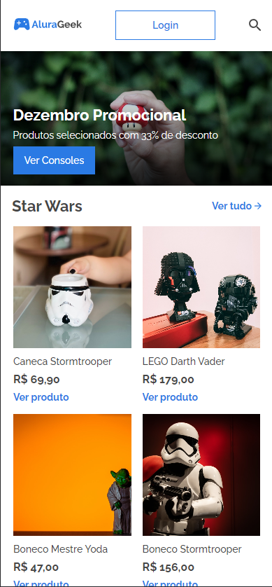
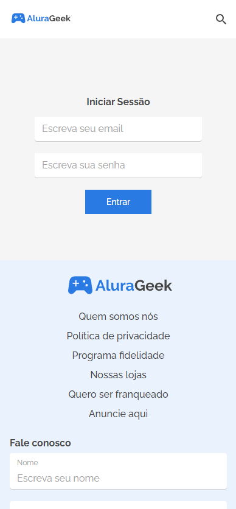
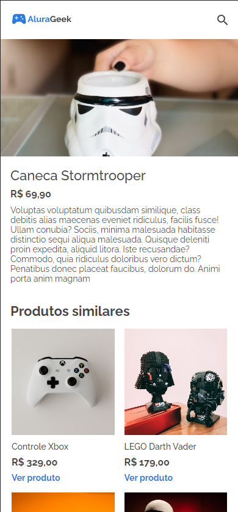
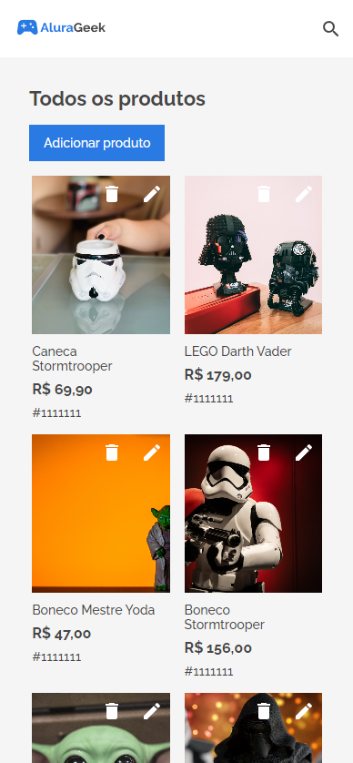
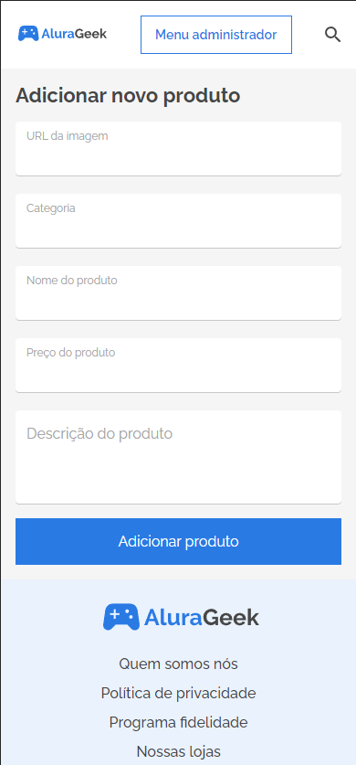

<h1>AluraGeek | 5º Alura Challenge Front-End</h1>

Repositório com o projeto do AluraGeek desenvolvido na 5ª Edição do Challenge de Front-End da Alura Escola Online de Tecnologia.

<h2>Status</h2>

<h4>:construction: Semana 3 e 4 em desenvolvimento :construction:</h4>

<h2>Sobre o AluraGeek</h2>

O AluraGeek é um ecommerce fictício de produtos do mundo geek.

  

 

A loja online possui a interface do cliente com a home, página de login, página de lista de produtos e página com mais detalhes sobre o produto. A plataforma também possui uma interface do administrados com um formulário para cadastrar novos produtos.

    
		
		
		
		

 

Além disso, todas as páginas possuem um footer com informações institucionais e um formulário de contato. E também possuem um header com barra de pesquisa.

<h2>Sobre o Challenge</h2>

Baseado no Challenge Based Learning da Apple os desafios da Alura replicam o fluxo de trabalho de um desenvolvedor.

As tarefas são divididas em 4 fases e disponibilizadas semanalmente em quadros do Trello. E para este desafio as semanas foram divididas em:

<ul>
	<li>Semana 1 (site estático): desenvolver componentes (header, footer, forms, buttons, sections) e home;</li>
  <li>Semana 2 (site estático): desenvolver página login, lista de produtos, novos produtos, descrição de produtos e produtos similares.</li>
  <li>Semana 3 e 4 (site dinâmico): validação de formulário de login, contato e novos produtos, API lista de produtos, API descrição de produto, barra de pesquisa e funcionalidade ver tudo.</li>
</ul>

Para o desenvolvimento do AluraGeek também foi fornecido o design do Figma com os layouts para mobile, tablet e desktop.

  

 

A abordagem utilizada para este projeto foi a mobile first. As media queries usadas foram de 768px e 1280px. E para o CSS foi utilizado o método BEM.

<h2>Tecnologias utilizadas</h2>

    
    
    

